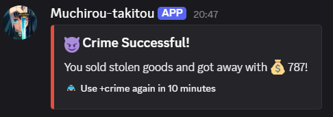
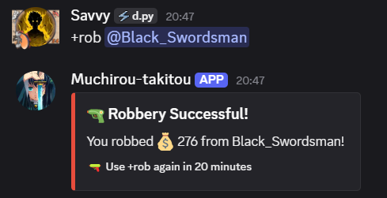
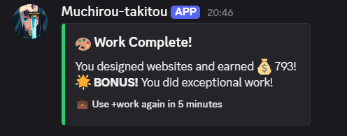
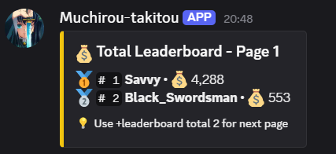
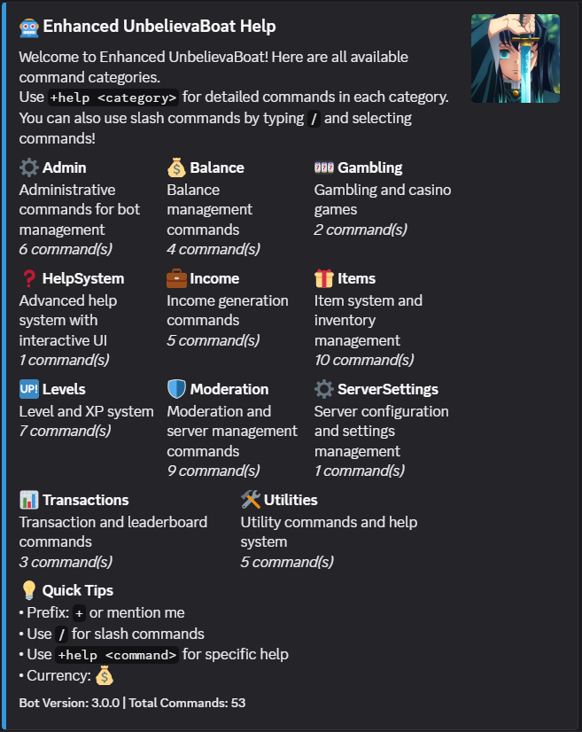

# Skender v3.0.0 — Released 12 August 2025

Welcome to **Enhanced UnbelievaBoat v3.0.0**!  
This release takes the bot to the next level with a fully modular design, advanced customization options, and smoother usability.

---

## 🚀 What's New in v3.0.0

- **Modular Cogs Architecture**  
  All commands and features are now organized into individual cogs inside the `cogs` folder for easier expansion and maintenance.

- **Centralized Customization**  
  Configure everything in one place—`config.py`.  
  No more juggling environment variables.

- **Advanced Logging System**  
  Robust logging for real-time monitoring, easier debugging, and better transparency.

- **Slash Command Support**  
  Access all major features directly with Discord’s `/` slash commands.

- **Enhanced Help System**  
  Interactive help UI with neatly organized command categories.

- **Command Categories & Summaries**  
  Commands are grouped into clear categories, accessible via `+help <category>` or through slash commands.

---

## 📂 Command Categories & Counts

| Category          | Description                                  | Commands |
|-------------------|----------------------------------------------|----------|
| ⚙️ **Admin**       | Bot administration & management              | 6        |
| 💰 **Balance**     | Currency & balance management                | 4        |
| 🎰 **Gambling**    | Casino games & gambling commands              | 2        |
| ❓ **HelpSystem**  | Interactive help menu                        | 1        |
| 💼 **Income**      | Earning & income-related commands             | 5        |
| 🎁 **Items**       | Item creation, inventory & usage              | 10       |
| 🆙 **Levels**      | XP tracking & level system                    | 7        |
| 🛡️ **Moderation**  | Server moderation tools                      | 9        |
| ⚙️ **ServerSettings** | Server-wide configuration settings        | 1        |
| 📊 **Transactions**| Transactions, economy stats & leaderboards  | 3        |
| 🛠️ **Utilities**   | General tools & extra utilities               | 5        |

**Total Commands:** **53**

---

## 💡 Quick Usage Tips

- **Prefix:** `+` or mention the bot  
- **Slash Commands:** Use `/` for modern, autocomplete-driven commands  
- **Help:** `+help <command>` for detailed command info  
- **Currency Symbol:** 💰  

---

## 🖼️ Screenshots

### Crime Command  

### Rob Command  

### Work Command  

### Leaderboard  

### Help System  

---

## 🧩 Additional Notes

- **Easy Feature Expansion**  
  Add a new cog in `cogs` and load it in `main.py`—no complicated setup.

- **Improved Stability & Error Handling**  
  More graceful error messages and fewer crashes.

- **Dependencies & Requirements**  
  - Python **3.11+**  
  - Packages: `discord.py`, `requests`  
  - All settings are in `config.py`—no `.env` files required.

- **Upgrading from v2.x**  
  Simply replace your files, update `config.py`, and you’re ready—no migration scripts needed.

- **Support & Documentation**  
  - Discord: **kendrik2.0**  
  - GitHub: Open an issue on the repository.

---

**Version:** `3.0.0`  
**Release Date:** `12 Aug 2025`  
**Total Commands:** `53`